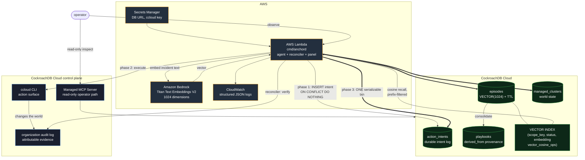

# Architecture

The double arrows are the point: phase 3 writes the intent resolution, the world
state, and the memory row with its embedding in **one serializable transaction**.
Everything else in this diagram could be assembled from ordinary parts. That one
transaction is what a separate vector database cannot offer.

## Components

| Package | Responsibility |
|---|---|
| `internal/protocol` | Idempotency key derivation, the three phases, the reconciler |
| `internal/verify` | Action registry and the three-valued verdict contract |
| `internal/ccloud` | The action surface and the audit-log verifier |
| `internal/memory` | Recall, consolidation, decay, time travel |
| `internal/store` | pgx plumbing, `Vector` codec, SQLSTATE classification |
| `internal/bedrock` | Titan embeddings |
| `internal/panel` | Observability page and its JSON API |
| `internal/control` | The architecture this project argues against |
| `internal/fakeworld` | Deterministic external API for the chaos test |

## Data flow for one incident

1. **Open.** An episode row is created with the symptom embedded. It exists
   before phase 1 because `idem_key` hashes `episode_id`.
2. **Recall.** Cosine search over `episodes` and `playbooks`, filtered on prefix
   columns only. Salience and recency are applied in Go, because a non-prefix
   predicate silently disqualifies the vector index.
3. **Decide.** Recalled episodes and any consolidated playbook inform the action.
4. **Intend.** The durable intent is written *before* anything external happens.
5. **Execute.** ccloud changes the world, carrying the idempotency key.
6. **Commit.** One transaction: intent resolved, world state advanced, memory
   written and pinned against TTL.
7. **Consolidate.** Once three similar incidents resolve, they are promoted into
   a playbook whose steps come from intents that actually committed, with
   `derived_from` naming the sources. The sources are archived, never deleted,
   because the provenance and the time-travel path both need them.

## Why one binary

`cmd/anchord` is an HTTP server locally and a Lambda behind a Function URL in
AWS. The handler is identical in both, so the demo shows what actually runs. The
Function URL adapter is thirty lines written by hand rather than a proxy
dependency whose only job is translating one struct.

## Memory lifecycle

- **Recall** ranks by a weighted combination of similarity, recency, and
  salience, with the components exposed separately so the panel can show *why*
  something was recalled.
- **Consolidate** derives playbooks from committed intents, not from model
  output. Every step traces to something the agent really did.
- **Decay** reduces salience with age and schedules faded memories for row-level
  TTL. It never writes `expires_at` on a row where it is NULL, because that NULL
  is what pins an episode with a committed action.
- **Time travel** answers "what did the agent believe at time T" through
  `AS OF SYSTEM TIME` over MVCC, rather than an application-maintained audit
  table that only records what someone remembered to write.
